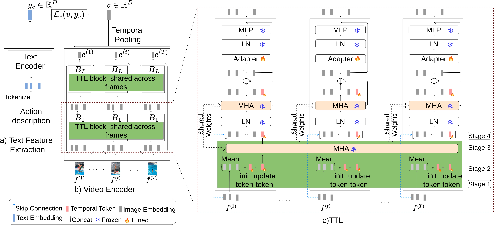

# EZ-CLIP: Efficient Zero-Shot Video Action Recognition

**Official PyTorch Implementation**  
[](https://arxiv.org/abs/2312.08010) [](https://openreview.net/forum?id=xxxx) [](https://github.com/Shahzadnit/T2L.git)

---

## 🚀 Major Announcement: Published in TMLR 2025!

🎉 **EZ-CLIP has evolved into *T2L: Efficient Zero-Shot Action Recognition with Temporal Token Learning*** and is now published in **Transactions on Machine Learning Research (TMLR) 2025**!  
We’ve released a new, enhanced codebase for T2L, incorporating the latest advancements. **Visit the new repository for the most up-to-date code and resources**:  
👉 [**T2L Repository**](https://github.com/Shahzadnit/T2L.git) 👈  

This EZ-CLIP repository remains available for reference but may not receive further updates. Explore T2L for the cutting-edge implementation!

---

## Updates
- 📦 **Trained Models**: Download pre-trained models from [Google Drive](https://drive.google.com/drive/folders/1OPt5cXSx-1u_hRXSpst94gMJ5P-c7uBS?usp=sharing).  
- 📄 **Published Paper**: See details in the TMLR 2025 publication and new T2L repository.

## Overview



**EZ-CLIP** is an innovative adaptation of CLIP tailored for **zero-shot video action recognition**. By leveraging **temporal visual prompting**, it seamlessly integrates temporal dynamics while preserving CLIP’s powerful generalization. A novel motion-focused learning objective enhances its ability to capture video motion, all without altering CLIP’s core architecture.

For the latest advancements, check out **T2L: Efficient Zero-Shot Action Recognition with Temporal Token Learning** in the [T2L Repository](https://github.com/Shahzadnit/T2L.git).

## Contents
- [Introduction](#introduction)
- [Prerequisites](#prerequisites)
- [Model Zoo](#model-zoo)
- [Data Preparation](#data-preparation)
- [Training](#training)
- [Testing](#testing)
- [Citation](#citation)
- [Acknowledgments](#acknowledgments)

## Introduction
EZ-CLIP tackles the challenge of adapting CLIP for zero-shot video action recognition with a lightweight and efficient approach. Through **temporal visual prompting** and a specialized learning objective, it captures motion dynamics effectively while retaining CLIP’s generalization capabilities. This makes EZ-CLIP both practical and powerful for video understanding tasks.

The work has been significantly advanced in our TMLR 2025 publication, **T2L: Efficient Zero-Shot Action Recognition with Temporal Token Learning**. Explore the [T2L Repository](https://github.com/Shahzadnit/T2L.git) for the latest developments.

## Prerequisites
Set up the environment using the provided `requirements.txt`:
```bash
pip install -r requirements.txt
```

## Model Zoo
**Note**: All models are based on the publicly available ViT/B-16 CLIP model.

### Zero-Shot Results
Trained on Kinetics-400 and evaluated on downstream datasets.

| Model                | Input  | HMDB-51 | UCF-101 | Kinetics-600 | Model Link                                                                 |
|----------------------|--------|---------|---------|--------------|---------------------------------------------------------------------------|
| EZ-CLIP (ViT-16)     | 8x224  | 52.9    | 79.1    | 70.1         | [Link](https://drive.google.com/file/d/19QNGgaZjPyq0yz7XJGFccS7MV09KMY_K/view?usp=drive_link) |

### Base-to-Novel Generalization Results
Datasets are split into base and novel classes, with models trained on base classes and evaluated on both.

| Dataset   | Input  | Base Acc. | Novel Acc. | HM   | Model Link                                                                 |
|-----------|--------|-----------|------------|------|---------------------------------------------------------------------------|
| K-400     | 8x224  | 73.1      | 60.6       | 66.3 | [Link](https://drive.google.com/file/d/1q8rBkL0QKNTeJJihWkNUwm1eAGH_OY0U/view?usp=sharing) |
| HMDB-51   | 8x224  | 77.0      | 58.2       | 66.3 | [Link](https://drive.google.com/file/d/1hW2i6agAhpyFvoRgPcOki3coQHx-6oWN/view?usp=sharing) |
| UCF-101   | 8x224  | 94.4      | 77.9       | 85.4 | [Link](https://drive.google.com/file/d/16HTxwbqfi1N8BPVjfrvL6F_A4xLNt-zc/view?usp=sharing) |
| SSV2      | 8x224  | 16.6      | 13.3       | 14.8 | [Link](https://drive.google.com/file/d/1EtpET-s634JnHK7n57vrvqNpE7qH_dHq/view?usp=sharing) |

## Data Preparation
Extract videos into frames for efficient processing. See the `Dataset_creation_scripts` directory for instructions.  
Supported datasets:
- [Kinetics](https://deepmind.com/research/open-source/open-source-datasets/kinetics/)
- [UCF101](http://crcv.ucf.edu/data/UCF101.php)
- [HMDB51](http://serre-lab.clps.brown.edu/resource/hmdb-a-large-human-motion-database/)

## Training
Train EZ-CLIP with:
```bash
python train.py --config configs/K-400/k400_train.yaml
```

## Testing
Evaluate a trained model with:
```bash
python test.py --config configs/ucf101/UCF_zero_shot_testing.yaml
```

## Citation
If you find this code or models useful, please cite our work:

**TMLR 2025 Publication**:
```bibtex
@article{ahmad2025t2l,
  title={T2L: Efficient Zero-Shot Action Recognition with Temporal Token Learning},
  author={Ahmad, Shahzad and Chanda, Sukalpa and Rawat, Yogesh S},
  journal={Transactions on Machine Learning Research},
  year={2025}
}
```

**arXiv Preprint**:
```bibtex
@article{ahmad2023ezclip,
  title={EZ-CLIP: Efficient Zero-Shot Video Action Recognition},
  author={Ahmad, Shahzad and Chanda, Sukalpa and Rawat, Yogesh S},
  journal={arXiv preprint arXiv:2312.08010},
  year={2023}
}
```

## Acknowledgments
This codebase builds upon [ActionCLIP](https://github.com/sallymmx/ActionCLIP). We express our gratitude to the authors for their foundational contributions.  
For the latest updates, visit the [T2L Repository](https://github.com/Shahzadnit/T2L.git).

---

**Contact**: For questions or issues, please open an issue on this repository or the [T2L Repository](https://github.com/Shahzadnit/T2L.git).

**Explore the Future of Zero-Shot Action Recognition with T2L!**  
👉 [**T2L Repository**](https://github.com/Shahzadnit/T2L.git) 👈
