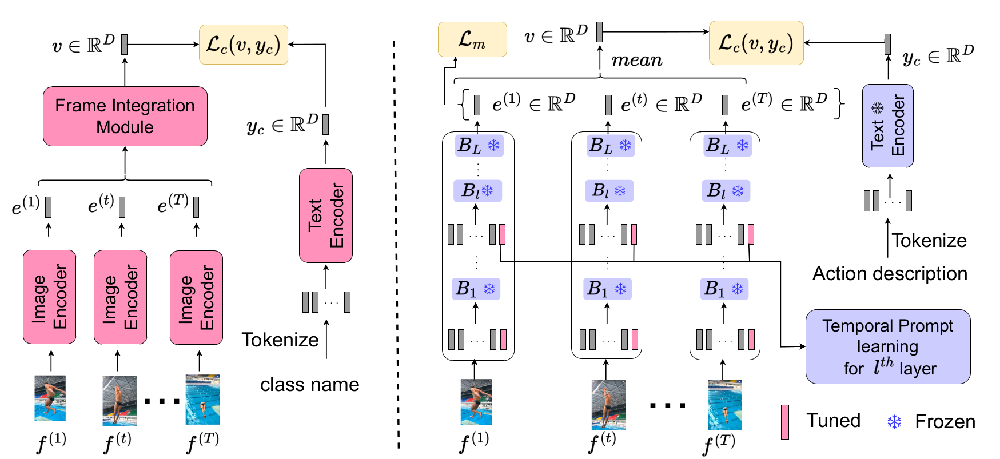

# This is an official pytorch implementation of EZ-CLIP: Efficient Zero-Shot Video Action Recognition [[arXiv]](https://arxiv.org/abs/2312.08010)

## Updates
 - Trained model download link of [google driver](https://drive.google.com/drive/folders/1OPt5cXSx-1u_hRXSpst94gMJ5P-c7uBS?usp=sharing).


## Overview



# Introduction
In this study, we present EZ-CLIP, a simple and efficient adaptation of CLIP that
addresses these challenges. EZ-CLIP leverages temporal visual prompting for
seamless temporal adaptation, requiring no fundamental alterations to the core
CLIP architecture while preserving its remarkable generalization abilities. Moreover, we introduce a novel learning objective that guides the temporal visual
prompts to focus on capturing motion, thereby enhancing its learning capabilities from video data


## Content 
- [Prerequisites](#prerequisites)
- [Data Preparation](#data-preparation)
- [Training](#training)
- [Testing](#testing)
- [Acknowledgments](#Acknowledgments)

## Prerequisites

We provide the conda requirements.txt to help you install these libraries. You can initialize environment by using `pip install -r requirements.txt`.

## Data Preparation
We need to first extract videos into frames for fast reading. Please refer 'Dataset_creation_scripts' data pre-processing.
We have successfully trained on [Kinetics](https://deepmind.com/research/open-source/open-source-datasets/kinetics/), [UCF101](http://crcv.ucf.edu/data/UCF101.php), [HMDB51](http://serre-lab.clps.brown.edu/resource/hmdb-a-large-human-motion-database/),

## Training
```
# Train
python train.py --config configs/K-400/k400_train.yaml

```

## Testing
```
# Test 
python test.py --config configs/ucf101/UCF_zero_shot_testing.yaml

```

## Citation
If you find the code and pre-trained models useful for your research, please consider citing our paper:

```
@article{ez2022clip,
  title={EZ-CLIP: Efficient Zeroshot Video Action Recognition},
  author={Shahzad Ahmad, Sukalpa Chanda, Yogesh S Rawat},
  journal={arXiv preprint arXiv:2312.08010},
  year={2024}
}
```


# Acknowledgments
Our code is based on [ActionCLIP](https://github.com/sallymmx/ActionCLIP?tab=readme-ov-file) 

