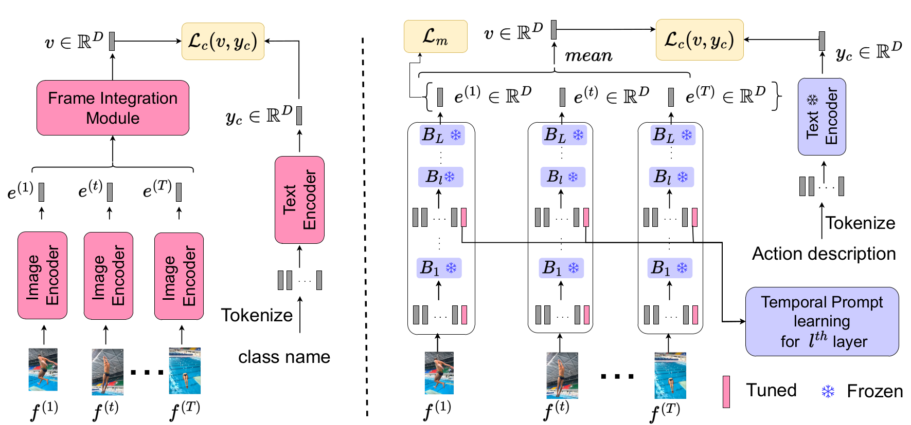

# This is an official pytorch implementation of EZ-CLIP: Efficient Zero-Shot Video Action Recognition [[arXiv]](https://arxiv.org/abs/2312.08010)


## Overview




## Content 
- [Prerequisites](#prerequisites)
- [Data Preparation](#data-preparation)
- [Training](#training)
- [Testing](#testing)
- [Acknowledgments](#Acknowledgments)

## Prerequisites

We provide the conda requirements.txt to help you install these libraries. You can initialize environment by using `pip install -r requirements.txt`.

## Data Preparation
We need to first extract videos into frames for fast reading. Please refer 'Dataset_creation_scripts' data pre-processing.
We have successfully trained on [Kinetics](https://deepmind.com/research/open-source/open-source-datasets/kinetics/), [UCF101](http://crcv.ucf.edu/data/UCF101.php), [HMDB51](http://serre-lab.clps.brown.edu/resource/hmdb-a-large-human-motion-database/),

## Training
```
# Train Zero shot
python train.py --config configs/K-400/k400_train.yaml

```

## Testing
```
# Test Zero shot
python test_zero_and_few_shot.py --config configs/ucf101/UCF_zero_shot_testing.yaml

```


# Acknowledgments
Our code is based on [ActionCLIP](https://github.com/sallymmx/ActionCLIP?tab=readme-ov-file) 

